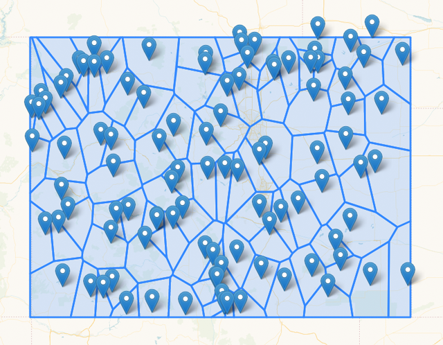

# Voronoi Polygon [with areas] example from random points

This example creates random points within Colorado and then creates voronoi polygons based on them.  The polygons are attributed with an area with the area function, which is converted and added as properties to the polygon.  The included index.html file allows for some visual affordance for the output.

The example uses the Turf [`turf.randomPoints()`](http://turfjs.org/docs#randomPoints) method to create random points.
The example uses the Turf [`turf.voronoi()`](http://turfjs.org/docs#voronoi) method to create the voronoi polygons.
The example uses the Turf [`turf.area()`](http://turfjs.org/docs#area) method to calculate the area.
The example uses the Turf [`turf.convertArea()`](http://turfjs.org/docs#convertArea) method to calculate the buffer.

Output Voronoi polygons and the random points.

